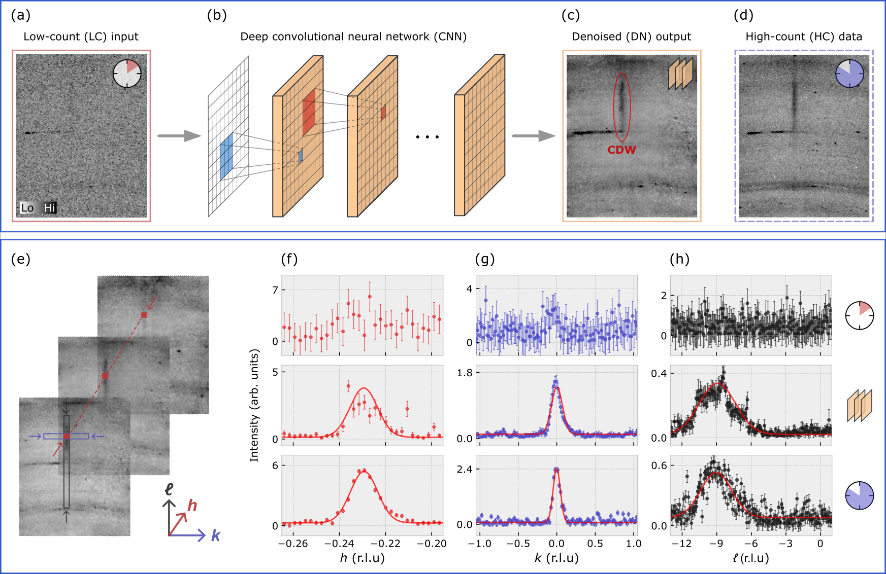

## X-ray diffraction denoising using deep convolutional neural networks

This repository contains Python source code for training a deep convolutional neural network to denoise experimental low-counting statistics X-ray diffraction data. It provides the neural-network definitions as well as a training pipeline. The expected format of low- and high-count data is TIF. Furthermore, the data is expected to be located in separate folders named "LC" and "HC" for both training and validation data sets. A helper function for converting the provided (training, validation, and test) HDF5 files at Zenodo (https://doi.org/10.5281/zenodo.8237173) to individual TIF files is given in `helper_functions.py`, named `convert_zenodo_hdf5_to_tif()`.

<!--  -->

 

Required packages (Python 3):
- numpy
- pandas
- pillow
- scipy
- h5py
- tensorflow 2.4.1 (optional but recommended: tensorflow-gpu)

Original work and data:
- J. Oppliger et al., “Weak-signal extraction enabled by deep-neural-network denoising of diffraction data.” arXiv, Sep. 19, 2022. doi: 10.48550/arXiv.2209.09247.
- J. Oppliger et al., “X-ray diffraction dataset for experimental noise filtering.” Zenodo, Jul. 24, 2022. doi: 10.5281/zenodo.8237173.
